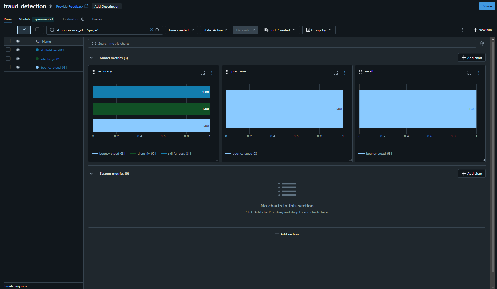
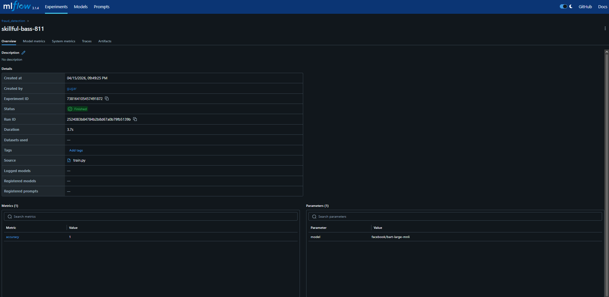
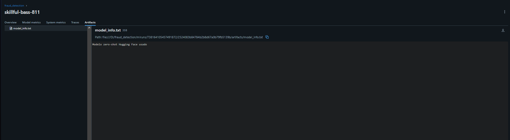

# Relatório de Entrega — Projeto Individual 2: Sistema de ML com MLflow

> **Aluno(a):** [Gustavo da Rocha Machado Quirino]
> **Matrícula:** [251021321]
> **Data de entrega:** [15/04/2026]

---

## 1. Resumo do Projeto

Este projeto tem como objetivo desenvolver um sistema de machine learning end-to-end para detecção de fraude em transações, com foco na engenharia do pipeline e uso do MLflow. Foi utilizado um modelo pré-treinado da biblioteca Hugging Face Transformers (facebook/bart-large-mnli), aplicando a técnica de zero-shot classification, permitindo classificar transações sem necessidade de treinamento adicional.

O sistema foi estruturado em etapas de ingestão, pré-processamento, inferência, avaliação e registro no MLflow, garantindo rastreabilidade e reprodutibilidade. Como resultado, o sistema conseguiu classificar corretamente exemplos de transações com base em descrições textuais, além de registrar métricas e artefatos no MLflow.

---

## 2. Escolha do Problema, Dataset e Modelo

### 2.1 Problema

O problema escolhido foi a detecção de fraude em transações financeiras. Esse problema é altamente relevante no contexto atual, pois instituições financeiras precisam identificar comportamentos suspeitos rapidamente para evitar prejuízos.

### 2.2 Dataset

| Item | Descrição |
|------|-----------|
| **Nome do dataset** | Dataset sintético de transações|
| **Fonte** |Criado manualmente |
| **Tamanho** |Pequeno (exemplos simulados) |
| **Tipo de dado** |Texto (descrições de transações) |

### 2.3 Modelo pré-treinado

| Item | Descrição |
|------|-----------|
| **Nome do modelo** | facebook/bart-large-mnli|
| **Fonte** (ex: Hugging Face) | Hugging Face|
| **Tipo** (ex: classificação, NLP) | NLP|
| **Fine-tuning realizado?** |  Não |

---

## 3. Pré-processamento

_Descreva as decisões de pré-processamento aplicadas aos dados:_

Como o modelo utilizado é zero-shot, o pré-processamento foi simplificado. Os dados foram estruturados como textos descritivos de transações e organizados em listas. Não foi necessário tratamento complexo, pois o modelo já é capaz de interpretar linguagem natural.

---

## 4. Estrutura do Pipeline

O pipeline segue a seguinte estrutura:

```
Ingestão → Pré-processamento → Carregamento do modelo → Avaliação → Registro MLflow → Deploy
```

### Estrutura do código

```
fraud_detection/
├── data/
│   └── fraud.csv
├── src/
│   ├── train.py
│   ├── predict.py
│   ├── preprocess.py
│   ├── guardrails.py
├── mlruns/
├── requirements.txt
├── relatorio.md
└── README.md 
```

---

## 5. Uso do MLflow

### 5.1 Rastreamento de experimentos

O MLflow foi utilizado para registrar experimentos de inferência com o modelo pré-treinado.

- **Parâmetros registrados:**
1. model = facebook/bart-large-mnli
2. task = zero-shot-classification
- **Métricas registradas:**
1. accuracy
- **Artefatos salvos:**
1. predictions.txt

### 5.2 Versionamento e registro

Cada execução do pipeline gera um novo "run" no MLflow, permitindo versionamento automático dos experimentos. Isso garante rastreabilidade e reprodutibilidade.

### 5.3 Evidências

### Experimentos no MLflow


### Run com métricas


### Artefatos gerados


---

## 6. Deploy

O modelo foi disponibilizado por meio de um script local de inferência.

- **Método de deploy:** Script local (predict.py)
- **Como executar inferência:**

```bash
# python src/predict.py
```

---

## 7. Guardrails e Restrições de Uso

Foram implementados mecanismos de controle de confiança das previsões:

- Baixa confiança → recomendação de revisão manual
- Alta confiança → alerta de possível fraude

---

## 8. Observabilidade

O monitoramento foi realizado utilizando MLflow.

- **Comparação de execuções:**
Permite visualizar múltiplos runs e comparar métricas.
- **Análise de métricas:**
Acurácia registrada em cada execução.
- **Capacidade de inspeção:**
Acesso a parâmetros, métricas e artefatos via interface do MLflow.

---

## 9. Limitações e Riscos

- Dataset pequeno e sintético
- Modelo pode não generalizar bem para dados reais
- Zero-shot pode apresentar incertezas em textos ambíguos

---

## 10. Como executar

_Instruções passo a passo para rodar o projeto:_

```bash
# 1. Instalar dependências pip install -r requirements.txt 

# 2. Executar o pipeline python src/train.py 

# 3. Iniciar o MLflow UI python -m mlflow ui 

# 4. Executar inferência python src/predict.py
```

---

## 11. Referências

1. Hugging Face Trabsformers
2. MLflow Documentation


---

## 12. Checklist de entrega

- [X] Código-fonte completo
- [X] Pipeline funcional
- [X] Configuração do MLflow
- [X] Evidências de execução (logs, prints ou UI)
- [X] Modelo registrado
- [X] Script ou endpoint de inferência
- [X] Relatório de entrega preenchido
- [X] Pull Request aberto
